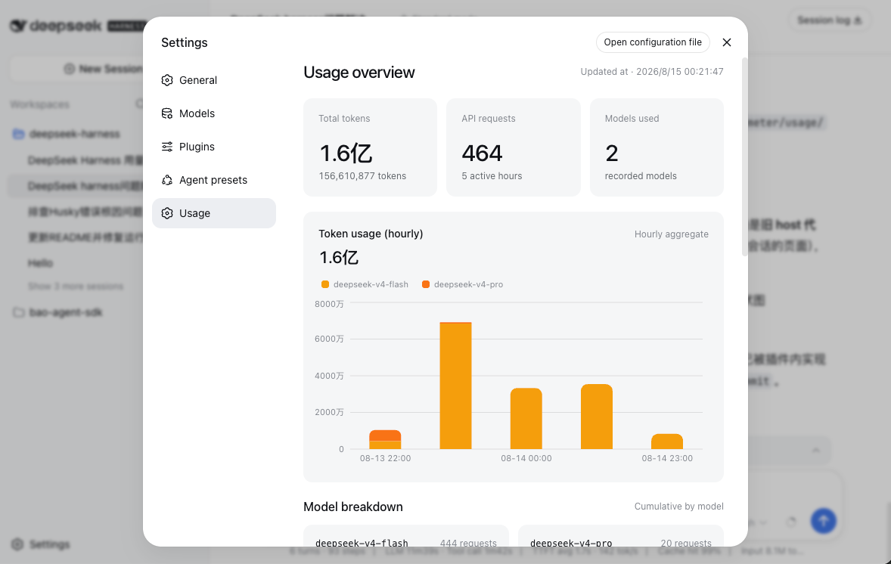

# dsh-usage-meter

A DeepSeek Harness usage recorder: tracks token usage per model call, aggregates it by model × hour, and shows it in the Web GUI settings page as a stacked bar chart (one bar per hour, colored per model).

English · [中文](README.md)



## Install

```sh
pnpm dsh plugin --profile web add @dsh-usage-meter/usage
```

> If resolution fails on the publish day, pin the version explicitly (e.g. `@dsh-usage-meter/usage@0.3.0`).

Restart `dsh web`, then open Settings → Usage.

## Uninstall

```sh
pnpm dsh plugin --profile web remove @dsh-usage-meter/usage
```

## Data

Stored at `$DSH_HOME/usage-meter/usage.jsonl`, re-aggregated hourly on startup; the UI is bilingual and follows the GUI language.

## License

MIT
