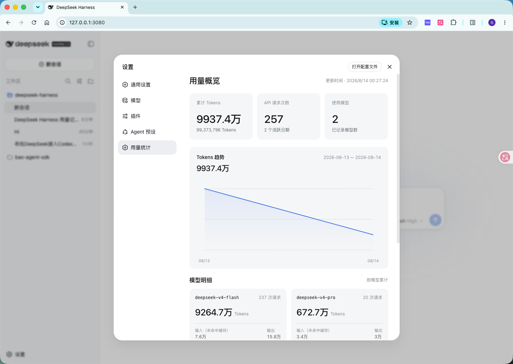

# dsh-usage-meter

DeepSeek Harness 用量统计插件：自动记录每次模型调用的 token 用量，按「模型 × 天」聚合，在 Web GUI 设置页展示。

[🌐 English](README.en.md) · 中文



## 功能

- 记录每次模型调用的**输入 / 输出 / 缓存命中 / 缓存写入**，按模型 × 天聚合
- 设置页「用量统计」展示累计与每日明细（调用次数、计费合计等）
- 数据持久化到 `$DSH_HOME/usage-meter/usage.jsonl`
- 中英双语，跟随 Web GUI 语言设置

## 安装

```sh
npx -p @deepseek-ai/dsh dsh plugin --profile web add @dsh-usage-meter/usage@0.2.0 --registry=https://registry.npmjs.org/
```

> 与官方 `npx @deepseek-ai/dsh web` 同源的安装方式；如果你是用源码跑 dsh（`pnpm dsh web`），把开头的 `npx -p @deepseek-ai/dsh dsh` 换成 `pnpm dsh` 即可。
>
> 钉版本是因为 profile 的 pnpm 供应链策略会静默跳过发布不足 1 天的版本——新版本刚发布时只写包名可能解析失败，显式钉版本可立即安装。

重启 `dsh web` 后，设置 → 用量统计 即可查看。

## 卸载

```sh
dsh plugin --profile web remove @dsh-usage-meter/usage
```

## 许可

MIT
